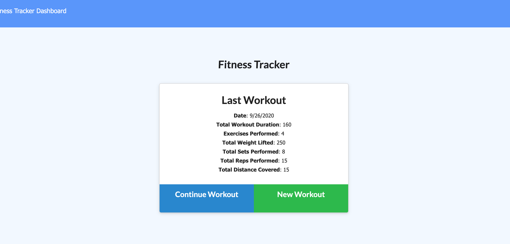
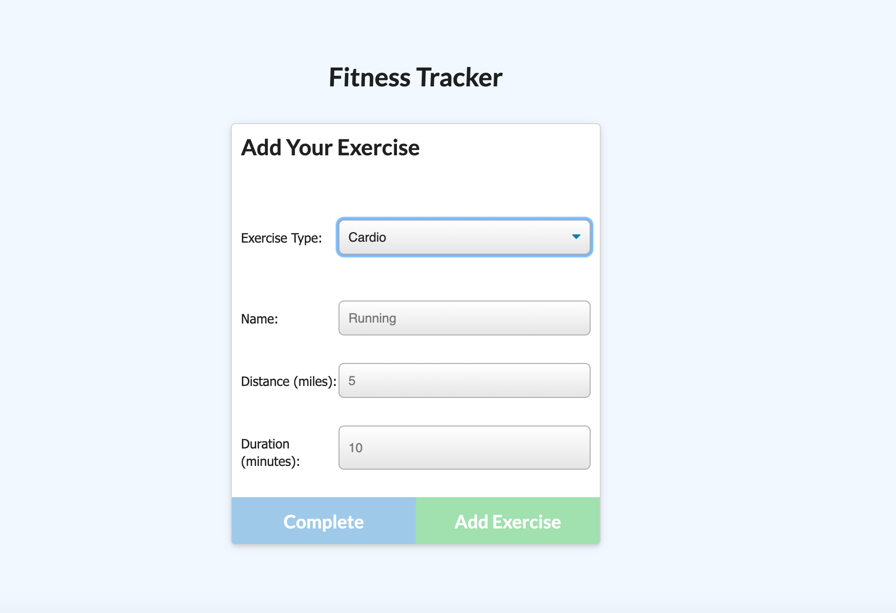
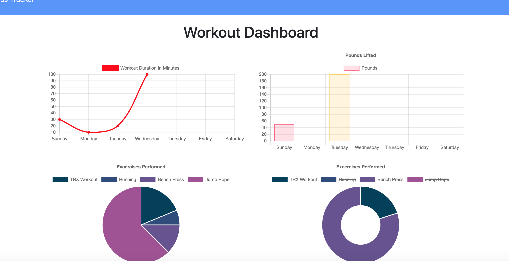

# Fitness Tracker

# Description

This is a simple fitness tracker which allows users to store either resistance or cardio exercises, view individual workout statistics, as well as weekly workout statistics.

# Table of Contents

- [Table of Contents](#table-of-contents)
- [Installation](#installation)
- [Usage](#usage)
- [License](#license)
- [Testing](#testing)
- [Contributing](#contributing)

# Installation

Run an npm install to ensure all required modules are installed before usage.

# Usage

This application is designed to be simple and user-friendly.

Home page: 

Form for completion of new exercise: 

Statistics page: 

This application is deployed on Heroku and can be visited here: https://stormy-harbor-82269.herokuapp.com/?id=5f6f9b43b625230017ffc967

# License

No additional licenses are needed for this application.

# Testing

There is currently no testing set up for this application.

# Contributing

When contributing to this project, please add clear and concise comments to all added code to ensure my and future users' understanding of additions and changes.
